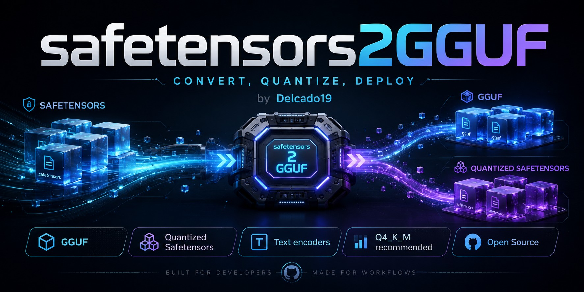

# safetensors2GGUF

Converts Safetensors / CKPT diffusion model checkpoints to **GGUF** for use with
**llama.cpp** and **ComfyUI-GGUF**, or to a quantized **Safetensors** file that
ComfyUI can load natively without the GGUF loader node. Also converts bare
single-file **text-encoder** checkpoints (Qwen3, T5/UMT5, Mistral, …) to GGUF.

- **GGUF output** — direct Python quantization (F32 / F16 / BF16 / Q8_0) and
  K-quant quantization via a bundled `llama-quantize` binary (Q6_K, Q5_K_M,
  Q4_K_M, Q4_K_S, Q3_K_M, Q2_K).
- **Safetensors output** — F16, ComfyUI-compatible scaled FP8, and Nvidia
  block-scaled NVFP4, each with a "mixed" variant that keeps critical layers
  at F32.
- **Text-encoder → GGUF** — converts bare text-encoder checkpoints that lack
  `config.json`/tokenizer files, using a base model's HuggingFace repo ID; runs
  fully standalone, auto-cloning `llama.cpp` on first use.

A Gradio web UI with file browser, quantization selector, live size estimate,
and cancel button is included for all three pipelines.

## Supported Architectures

| Architecture | Format |
|---|---|
| FLUX.1 | Diffusers |
| FLUX.2 (klein / Dev) | Diffusers (shares `flux` arch tag with Flux.1) |
| Stable Diffusion 3 | Diffusers |
| SDXL | Diffusers / Non-Diffusers |
| SD 1.x | Diffusers / Non-Diffusers |
| HiDream | Diffusers |
| HunyuanVideo | Diffusers |
| Wan | Diffusers |
| LTXV | Diffusers |
| Cosmos | Diffusers |
| AuraFlow | Diffusers |
| Lumina 2 | Diffusers |
| Z-Image (Turbo / Base) | Diffusers (shares `lumina2` arch tag) |
| Qwen-Image / Qwen-Image-Edit (incl. 2511) | Diffusers |

## Installation

```bash
git clone https://github.com/Delcado19/safetensors2GGUF.git
cd safetensors2GGUF

# Install uv (https://docs.astral.sh/uv/) then:
uv sync
```

Dependencies are maintained in `pyproject.toml` and locked in `uv.lock`.
This project does not maintain a separate `requirements.txt`.

<details>
<summary>Using pip instead</summary>

```bash
pip install gguf torch safetensors tqdm gradio huggingface_hub transformers sentencepiece protobuf
```

</details>

`uv sync` covers everything except GGUF K-quants:

- **GGUF K-quants** (`Q6_K`, `Q5_K_M`, …) need a `llama-quantize` binary —
  see [llama-quantize Sources](#llama-quantize-sources) below. F32/F16/BF16/Q8_0,
  the Safetensors output mode, and text-encoder conversion all work with
  `uv sync` alone.
- **Text-encoder → GGUF conversion** needs `git` on `PATH`: it auto-clones
  `llama.cpp` (for its `convert_hf_to_gguf.py`) into `.llama.cpp/` on first
  use — no ComfyUI installation required. See
  [Text-Encoder Conversion](#text-encoder-conversion) below.

## Web UI (recommended)

Double-click **`start_gui.bat`** — the browser opens automatically.

Or from the terminal:

```bash
uv run python gui.py
```

The UI provides:
- **File browser** to select the source model without typing paths
- **Quantization dropdown** with 10 curated levels (see table below)
- **Live status bar** with percentage embedded in text; scroll-blocked so streaming updates never hijack the viewport
- **Automatic pipeline** — K-quants trigger a 2-step convert → quantize run;
  5D tensor insertion (HunyuanVideo / Wan) is chained automatically when needed
- **SDXL component extraction** — analyze embedded VAE / CLIP-L / CLIP-G
  against local standard files, then export selected components to the ComfyUI
  `models\vae` and `models\clip` folders
- **Advanced performance controls** — pass a fixed thread count to
  `llama-quantize` and keep GUI tensor logging throttled during conversion
- **llama-quantize picker** — the path is auto-detected or selected with a
  native file dialog; manual path typing is disabled

## Quantization Levels

| Key | Bits | Backend | Notes |
|---|---|---|---|
| `F32` | 32 | Python | Full precision, largest |
| `F16` | 16 | Python | Half precision, standard default |
| `BF16` | 16 | Python | Brain float, best for BF16 source models |
| `Q8_0` | 8 | Python | Very high quality |
| `Q6_K` | 6 | llama-quantize | Very high quality |
| `Q5_K_M` | 5 | llama-quantize | High quality |
| `Q4_K_M` | 4 | llama-quantize | **Recommended** — good quality / size balance |
| `Q4_K_S` | 4 | llama-quantize | Good quality, smaller |
| `Q3_K_M` | 3 | llama-quantize | Moderate quality |
| `Q2_K` | 2 | llama-quantize | Smallest, lowest quality |

K-quants (marked *llama-quantize*) require a City96/ComfyUI-GGUF compatible
`llama-quantize` binary.  Upstream `ggml-org/llama.cpp` release binaries are
not selected automatically because they do not include the image-model patch
required for architectures such as Lumina 2.

The path is detected automatically from:
1. `LLAMA_QUANTIZE_PATH`
2. The ComfyUI Easy-Install bundled path:
`H:\ComfyUI-Easy-Install\Add-Ons\Tools\llama.cpp\llama-quantize.exe`
3. `COMFYUI_EASY_INSTALL_HOME` plus `Add-Ons\Tools\llama.cpp\llama-quantize.exe`
4. The system `PATH`

If no compatible binary is found, use the **Browse** button in the **Advanced**
section and select the `llama-quantize` executable.  The path field is
read-only on purpose, so users do not have to type or escape Windows paths.

### llama-quantize Sources

Recommended sources:

| OS | Source |
|---|---|
| Windows | ComfyUI Easy-Install bundled `Add-Ons\Tools\llama.cpp\llama-quantize.exe` |
| macOS / Linux | Build `llama-quantize` from `city96/ComfyUI-GGUF` using `tools/lcpp.patch` |

For a self-build (required on Linux/macOS, and on Windows without Easy-Install),
see **[docs/building-llama-quantize.md](docs/building-llama-quantize.md)** for
exact prerequisites and commands per OS — including a Visual Studio path and an
MSYS2/MinGW-w64 path that doesn't require installing Visual Studio at all.

The City96 patch is also a primary implementation reference, not only a build
step.  It documents how image GGUF architectures are registered in
`llama.cpp`, how `llama-quantize` should classify image-model tensors, and which
LLM-specific metadata assumptions must be bypassed for diffusion models.

## CLI Usage

```bash
# Convert to F16 GGUF (auto-detects output name)
uv run python convert.py --src model.safetensors

# Specify output path
uv run python convert.py --src model.safetensors --dst model-F16.gguf --overwrite
```

### Options

| Option | Description |
|---|---|
| `--src` | Source file (`.safetensors`, `.ckpt`, `.pt`, `.bin`, `.pth`) |
| `--dst` | Output GGUF path — auto-generated when omitted |
| `--overwrite` | Skip confirmation if output already exists |

### Fix Pad Tokens (Lumina 2 — existing GGUFs)

If ComfyUI raises *size mismatch for x_pad_token*, the GGUF was converted before
the shape fix was introduced.  Repair it with:

```bash
uv run python fix_pad_tokens.py --src model.gguf --dst model-fixed.gguf
```

| Option | Description |
|---|---|
| `--src` | Source GGUF (1D pad tokens) |
| `--dst` | Output GGUF path |
| `--overwrite` | Skip confirmation if output exists |

New conversions are unaffected — `convert.py` stores pad tokens as `[1, D]` automatically.

### SDXL Component Extraction

The **Extract Components** tab inspects SDXL checkpoints that bundle UNet, VAE,
CLIP-L, and CLIP-G in one `.safetensors` file.  It compares embedded components
with local standard references when present:

| Component | Embedded prefix | Local reference |
|---|---|---|
| VAE | `first_stage_model.*` | `models\vae\sdxlVAE.safetensors` |
| CLIP-L | `conditioner.embedders.0.*` | `models\clip\clip_l.safetensors` |
| CLIP-G | `conditioner.embedders.1.*` | `models\clip\clip_g.safetensors` |

After analysis, select the components to export.  VAE files are written to
`models\vae`; CLIP-L and CLIP-G files are written to `models\clip`.  CLIP-G is
converted from the embedded OpenCLIP key layout to the Comfy/HF key layout,
including Q/K/V split and `text_projection` transposition.

### 5D Tensor Post-processing (HunyuanVideo / Wan)

The Web UI applies this automatically after llama-quantize — no manual step
needed there.  For manual CLI workflows:

```bash
# 1. Convert to F16
uv run python convert.py --src model.safetensors

# 2. Quantize with llama-quantize (external step)
llama-quantize.exe model-F16.gguf model-Q8_0.gguf Q8_0

# 3. Insert 5D tensors
uv run python fix_5d_tensors.py --src model-Q8_0.gguf --dst model-Q8_0-fixed.gguf
```

## Benchmarking llama-quantize

Use the benchmark helper to compare compatible `llama-quantize`
binaries on the same source GGUF:

```bash
uv run python tools/benchmark_llama_quantize.py \
  --src model-F16.gguf \
  --quant Q4_K_M \
  --threads 8 \
  --exe H:\ComfyUI-Easy-Install\Add-Ons\Tools\llama.cpp\llama-quantize.exe \
  --exe path\to\another\patched\llama-quantize.exe
```

The benchmark writes temporary output GGUFs and removes them after timing.  Use
an F16, BF16, F32, or Q8_0 source GGUF for meaningful measurements.

## Safetensors Output

The **Convert → Safetensors** tab in the Web UI produces quantized `.safetensors`
files as an alternative to GGUF.  This is useful
when you want ComfyUI-compatible weights without the GGUF container format.

| Key | Format | Backend | Notes |
|---|---|---|---|
| `F16` | Half precision | Python | Standard default, smallest non-quantized size |
| `F16_MIXED` | Half precision, high-precision tensors stay F32 | Python | Matches GGUF K-quant behavior for critical layers |
| `FP8` | float8_e4m3fn, scaled (ComfyUI scaled-fp8 format) | Python | Per-layer `weight_scale` via ComfyUI convention |
| `FP8_MIXED` | FP8 scaled, high-precision tensors stay F32 | Python | Aggressive 8-bit quantization with protection |
| `NVFP4` | Nvidia 4-bit blockscaled (16-element blocks) | Python | Per-block + global scale, 16-block format |
| `NVFP4_MIXED` | NVFP4, high-precision tensors stay F32 | Python | Fine-grained 4-bit with critical-layer fallback |

**Why these formats:** FP8 and NVFP4 use ComfyUI's established scaled quantization
conventions (see `comfy/quant_ops.py` in `city96/ComfyUI-GGUF`). ComfyUI has no
loader for unscaled/generic FP4 formats, so bare 4-bit output would produce files
nothing can load — only the explicitly scaled variants are included.

## Text-Encoder Conversion

The **Convert Text Encoder → GGUF** tab converts
bare HF/Transformers text-encoder checkpoints (Qwen, T5, CLIP, Mistral variants) to
GGUF **or** quantized safetensors. This is separate from SDXL CLIP-L/CLIP-G
extraction and runs entirely in this tool's own Python environment — no
ComfyUI installation required.

The format dropdown covers three backends:

| Formats | Backend | Needs base repo ID? | Extra prerequisites |
|---|---|---|---|
| `F32`/`F16`/`BF16`/`Q8_0` | `convert_hf_to_gguf.py` (llama.cpp, auto-cloned) | Yes | `git` |
| `Q6_K`…`Q2_K` (K-quants) | Same, then a **plain** `llama-quantize` second pass | Yes | `git`, plus `cmake` + a C++ compiler (for the one-time `llama-quantize` build) |
| `FP8`/`FP8_MIXED`/`NVFP4`/`NVFP4_MIXED` | This tool's own safetensors quantizer (`safetensors_quant*.py`) | **No** | None — no llama.cpp, no download |

The K-quant path deliberately builds its **own** plain llama-quantize from the
auto-cloned llama.cpp checkout via `cmake` (cached under `.llama.cpp/build-quantize/`,
built once) — **not** the City96-patched binary used for diffusion-model GGUFs
(see [Building llama-quantize](docs/building-llama-quantize.md)), since that patch
is documented as unsafe for LLM/text GGUFs.

### Workflow

For **GGUF formats** (direct outtypes and K-quants), text-encoder conversion requires:

1. **Source weights file**: A single `.safetensors` checkpoint (bare model file, not
   a directory). Since standalone text-encoder `.safetensors` files lack `config.json`
   and tokenizer files, you must also provide:

2. **Base model HF repo ID**: The base model's Hugging Face repository (not a
   fine-tune's repo). For example:
   - For a Qwen-Image text encoder: `Qwen/Qwen2.5-VL-7B-Instruct`
   - For a Z-Image text encoder: A Qwen3 4B base model
   - For FLUX.2 klein: A Qwen3 4B or 8B base model

   The repo ID must have `config.json` (mandatory) and tokenizer files
   (`tokenizer.json`, `tokenizer.model`, etc.) — these are fetched from HuggingFace
   and assembled with your weights into a temporary HF-style directory.

3. **Output path and format**: Choose an output filename and one of the formats above.

For **FP8/FP8_MIXED/NVFP4/NVFP4_MIXED**, only the source weights file and an
output path are needed — the base repo ID field is ignored.

### Implementation

**GGUF path:**
1. Clones `llama.cpp` into `.llama.cpp/` next to this repo if not already
   present (skipped on subsequent runs).
2. Assembles a temporary directory with your source weights (renamed to
   `model.safetensors` to preserve the original file) and downloaded
   config/tokenizer files.
3. Runs `convert_hf_to_gguf.py` with this tool's own Python interpreter
   (`transformers`/`sentencepiece`/`protobuf` are regular dependencies in
   `pyproject.toml`, installed by `uv sync`).
4. For K-quants: builds a plain `llama-quantize` from the same clone (`cmake`,
   cached after the first run) and runs it as a second pass on the F16 output.
5. Returns the output at your chosen path.

**Safetensors path (FP8/NVFP4):** loads the checkpoint, applies the same
per-tensor FP8-scaled/NVFP4-block-scaled quantization used for diffusion models
(`safetensors_quant_fp8.py`/`safetensors_quant_nvfp4.py`), and writes a
ComfyUI-native quantized `.safetensors` file — no architecture-specific tensor
protection is needed here (unlike diffusion DiTs, ComfyUI's text-encoder loaders
build models from fixed config presets rather than inferring hyperparameters
from checkpoint tensor shapes, so there's no analogous shape-corruption risk;
see [docs/issues_analysis.md](docs/issues_analysis.md) #9 for that class of bug).

This is a subprocess/library pipeline, not part of the DiT architecture detection
system. Per-family text-encoder handling (e.g., SDXL CLIP key mapping, Qwen mmproj
pairing) is not automated — the generic HF-to-GGUF conversion handles supported
standard architectures. Unsupported or non-standard architectures require manual
key mapping.

Override the clone location with the `S2G_LLAMA_CPP_HOME` environment variable
if you already have a llama.cpp checkout elsewhere and want to reuse it.

### Reference: Encoder Family per Model Family

Candidate models for text-encoder GGUF conversion:

| Model family | Text encoder family | Status |
|---|---|---|
| SDXL 1.0 | CLIP-L + OpenCLIP-bigG | CLIP-specific extraction and key mapping (not generic HF-to-GGUF route) |
| Qwen-Image / Qwen-Image-Edit | Qwen2.5-VL 7B + mmproj | Multimodal text/image encoder; keep mmproj paired with the GGUF encoder |
| Z-Image / Z-Image-Turbo | Qwen3 4B | Standard HF/Transformers path via `convert_hf_to_gguf.py` |
| FLUX.1 / FLUX.1 Kontext | CLIP-L + T5-XXL | Existing Flux dual-encoder layout |
| FLUX.2 [klein] 4B | Qwen3 4B | Must keep 4B encoder paired with 4B model |
| FLUX.2 [klein] 9B | Qwen3 8B | Must keep 8B encoder paired with 9B model |
| FLUX.2 [dev] | Mistral Small 3.2 24B | Separate Mistral text-encoding path |
| ERNIE-Image / Turbo | Mistral3 + Ministral3 PE | Requires text encoder and prompt enhancer handling |

Primary model references:

- Stability AI SDXL Base model card:
  <https://huggingface.co/stabilityai/stable-diffusion-xl-base-1.0>
- Stability AI SDXL pipeline component map:
  <https://huggingface.co/stabilityai/stable-diffusion-xl-base-1.0/blob/main/model_index.json>
- Stability AI SDXL `text_encoder_2` config:
  <https://huggingface.co/stabilityai/stable-diffusion-xl-base-1.0/blob/main/text_encoder_2/config.json>
- LAION OpenCLIP ViT-bigG/14 model card:
  <https://huggingface.co/laion/CLIP-ViT-bigG-14-laion2B-39B-b160k>
- LAION OpenCLIP ViT-bigG/14 repository files:
  <https://huggingface.co/laion/CLIP-ViT-bigG-14-laion2B-39B-b160k/tree/main>
- OpenAI CLIP-L model card:
  <https://huggingface.co/openai/clip-vit-large-patch14>
- OpenAI CLIP-L repository files:
  <https://huggingface.co/openai/clip-vit-large-patch14/tree/main>
- Qwen-Image model card:
  <https://huggingface.co/Qwen/Qwen-Image>
- Qwen-Image-Edit model card:
  <https://huggingface.co/Qwen/Qwen-Image-Edit>
- Qwen2.5-VL 7B model card:
  <https://huggingface.co/Qwen/Qwen2.5-VL-7B-Instruct>
- ComfyUI Qwen-Image setup guide:
  <https://docs.comfy.org/tutorials/image/qwen/qwen-image>
- ComfyUI Qwen-Image-Edit setup guide:
  <https://docs.comfy.org/tutorials/image/qwen/qwen-image-edit>
- Tongyi-MAI Z-Image-Turbo model card:
  <https://huggingface.co/Tongyi-MAI/Z-Image-Turbo>
- Tongyi-MAI Z-Image-Turbo pipeline component map:
  <https://huggingface.co/Tongyi-MAI/Z-Image-Turbo/blob/main/model_index.json>
- Tongyi-MAI Z-Image-Turbo text encoder config:
  <https://huggingface.co/Tongyi-MAI/Z-Image-Turbo/blob/main/text_encoder/config.json>
- Black Forest Labs FLUX.1 Kontext model card:
  <https://huggingface.co/black-forest-labs/FLUX.1-Kontext-dev>
- Black Forest Labs FLUX.2 inference repository:
  <https://github.com/black-forest-labs/flux2>
- ComfyUI FLUX.2 [klein] setup guide:
  <https://docs.comfy.org/tutorials/flux/flux-2-klein>
- Baidu ERNIE-Image-Turbo model card:
  <https://huggingface.co/baidu/ERNIE-Image-Turbo>
- Baidu ERNIE-Image-Turbo pipeline component map:
  <https://huggingface.co/baidu/ERNIE-Image-Turbo/blob/main/model_index.json>
- ComfyUI ERNIE-Image setup guide:
  <https://docs.comfy.org/tutorials/image/ernie-image/ernie-image>

Candidate non-CLIP text encoder reference:

- Huihui Qwen3 4B model card:
  <https://huggingface.co/huihui-ai/Huihui-Qwen3-4B-abliterated-v2>
- Huihui Qwen3 4B repository files:
  <https://huggingface.co/huihui-ai/Huihui-Qwen3-4B-abliterated-v2/tree/main>

Tooling references:

- llama.cpp HF-to-GGUF converter:
  <https://github.com/ggml-org/llama.cpp/blob/master/convert_hf_to_gguf.py>
- ComfyUI-GGUF text encoder loader support:
  <https://github.com/city96/ComfyUI-GGUF>

## Possible Future Extensions

### Image GGUF Quantization Reference

City96's `tools/lcpp.patch` should be treated as the implementation reference
for image-model GGUF quantization support.  Even if it needs forward-porting for
newer `llama.cpp` versions, it captures the expected integration points:

- image architecture registration for families such as SD1, SDXL, SD3, Flux,
  HunyuanVideo, Wan, HiDream, Cosmos, and Lumina 2
- tensor classification rules for which weights may use K-quants and which
  tensors should remain higher precision
- loader and metadata adjustments so `llama-quantize` does not reject image
  GGUFs because they do not look like LLM checkpoints
- shape/name handling needed by ComfyUI-GGUF-compatible image models

Patch references:

- ComfyUI-GGUF tools guide:
  <https://github.com/city96/ComfyUI-GGUF/tree/main/tools>
- City96 `lcpp.patch`:
  <https://raw.githubusercontent.com/city96/ComfyUI-GGUF/main/tools/lcpp.patch>
- Current llama.cpp source layout:
  <https://github.com/ggml-org/llama.cpp/tree/master/src>

### Checkpoint GGUF Workflow

A later release could target full checkpoint workflows instead of only single
model files.  Two related directions are useful:

1. **Checkpoint decomposer / repacker**: split a monolithic checkpoint into its
   components, let the user choose quantization per component, convert each
   supported component, then write a new checkpoint manifest or bundle.
2. **Checkpoint loader node**: provide a ComfyUI node that accepts a checkpoint
   layout containing both regular `.safetensors` components and GGUF
   components, then loads each part through the correct backend.

The decomposer path should reuse SDXL component analysis for VAE / CLIP and add
model-family-aware handling for diffusion models and text encoders.  The loader
path is likely safer than trying to repack every component into one physical
file, because GGUF and safetensors have different metadata and loading
assumptions.

Implementation notes for future releases:

- Analyze first, convert second: identify UNet/DiT, VAE, CLIP, T5, Qwen, and
  Mistral-family components before presenting quantization options.
- Store conversion choices per component and keep source checkpoints untouched.
- Support mixed output layouts such as GGUF diffusion model + safetensors VAE +
  GGUF text encoder.
- Treat "repack into checkpoint" as a manifest/bundle problem unless ComfyUI
  gains a stable native format for mixed GGUF/safetensors checkpoints.
- Validate the resulting layout with a ComfyUI loader path rather than only
  checking that files were written.

## Known Issues

See [Issues Analysis](docs/issues_analysis.md) for common errors and their fixes.

## Running Tests

```bash
uv run pytest
uv run ruff check .
```

## License

Apache-2.0
